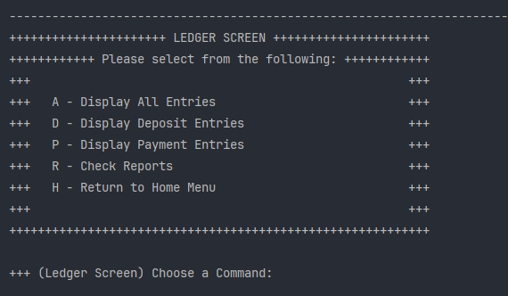
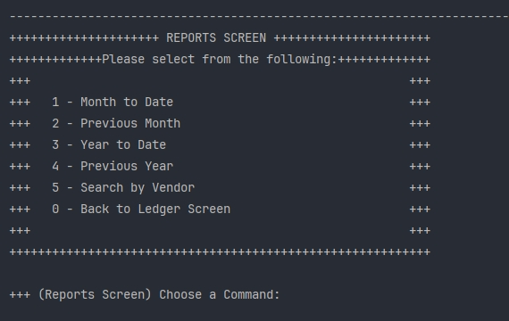

# Accounting Ledger Application

The Accounting Ledger Application is a Java-based tool with a Command Line Interface (CLI). This project manages financial transactions, generates reports, and maintains an accurate ledger. Users can add deposits, make payments, view transaction history, and generate various financial reports.

## Table of Contents

- [Features](#features)
- [Menu](#menu)
- [Screenshots](#screenshots)
- [Interesting Code](#interesting-code)
- [Project Structure](#project-structure)
- [Requirements](#requirements)
- [Getting Started](#getting-started)
- [Contributing](#contributing)
- [License](#license)

## Features

The application allows users to record and review financial transactions, stored in a CSV file.
- **Add Deposits**: Allows users to record deposits, with details like description, vendor, and amount.
- **Make Payments**: Allows users to record payments, with details like description, vendor, and amount.
- **View Transaction History**: View past transactions filtered by "All", "Deposits", or "Payments".
- **Generate Reports**: Users can generate reports for a number of criteria. See [Menu](#menu)

## Menu

| Home Screen Menu | Ledger Menu | Reports Menu |
| :---: | :---: | :---: |
| D - Add Deposit | A - View All Entries | 1 - Display This Month's Transactions |
| P - Make Payment | D - View Deposits | 2 - Display Last Month's Transactions |
| L - Ledger | P - View Payments | 3 - Display This Year's Transactions |
| E - Exit | R - Check Reports | 4 - Display Last Year's Transactions |
| | | 5 - Search Transactions By Vendor |

## Screenshots

This is a screenshot of the Home Screen Menu:


This is a screenshot of the Ledger Screen:



This is a screenshot of the Reports Screen:



## Interesting Code

One interesting piece of code is the overridden `toString()` method, which allows me to change how the default print statement looks like:

```java
@Override
    public String toString(){
        DateTimeFormatter dateTimeFormatter = DateTimeFormatter.ofPattern("HH:mm:ss");
        return String.format("%-10s | %-10s | %-40s | %-15s | $%5.2f", getDate(), getTime().format(dateTimeFormatter), getDescription(), getVendor(), getAmount());
    }
```
So, when I call the `toString` method in a print statement, I only have to put the class name of where that method is:

```java
for (int i = 0; i < transactions.size(); i++){
            Transaction t = transactions.get(i);
            if (t.getAmount() < 0){
                // only the Transaction class needs to be called, .toString() is optional to put here
                System.out.println((t.toString()));
            }
        }
```

## Project Structure

- **`AccountingLedgerApp.java`**: Main class for initializing and running the application. It includes the primary methods for launching the console interface and connecting the various components.
- **`Console.java`**: Handles user inputs and outputs, acting as the interface between the user and the application’s core functionalities.
- **`Transactions.java`**: Manages individual transaction details which are date, time, amount, date, and description.
- **`transactions.csv`**: CSV file that stores transaction data persistently. Each entry in the file records transaction details for retrieval and report generation.

## Requirements

- **Java Development Kit (JDK)** 11 or higher
- **IDE/Text Editor** (Optional, but recommended for development and testing)
- **CSV File** (`transactions.csv`) pre-set for storing transaction data

## Getting Started

1 - Clone the repository.

```bash
git clone https://github.com/YearUp-MusaHoosain/AccountingLedgerApp.git
```

2 - Navigate to the project directory.

3 - Compile and run the application

```bash  
javac AccountingLedgerApp.java
java AccountingLedgerApp
```

## Contributing

1. Fork the repository.
2. Create a new feature branch (`git checkout -b feature/YourFeature`).
3. Commit your changes (`git commit -m 'Add YourFeature'`).
4. Push to the branch (`git push origin feature/YourFeature`).
5. Open a Pull Request.

## License

This project is licensed under the MIT License. See the [LICENSE](LICENSE) file for more details.

---
